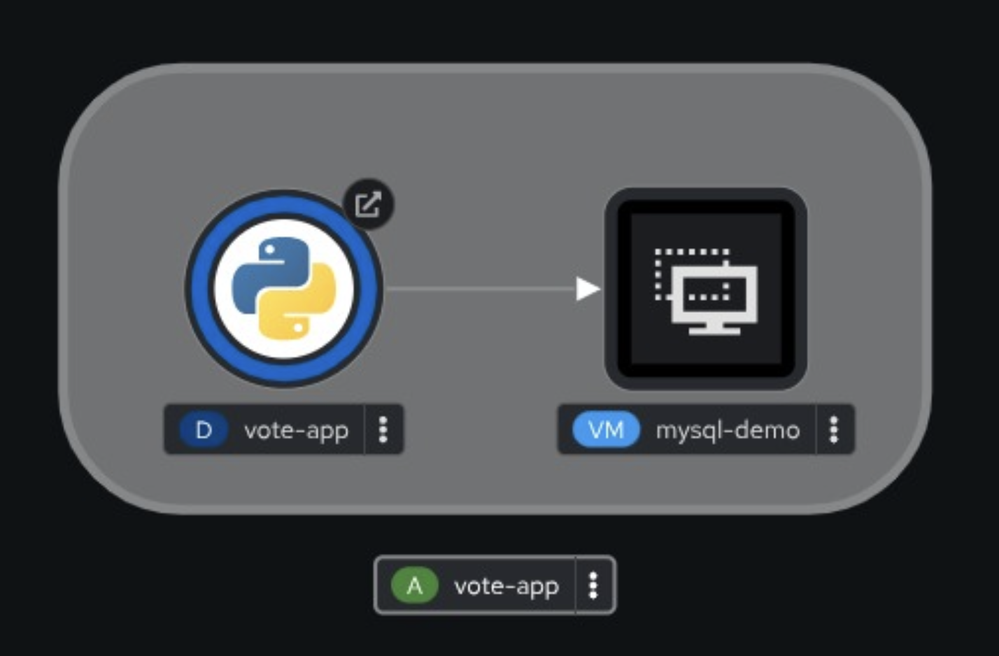

# Mixed Pod + VM OpenShift Virtualization GitOps demo

Use OpenShift Virtualization & GitOps to deploy a vote-app pod and a MySQL VM (running either RHEL or Centos-Stream9).

This yaml should work out-of-the-box with OpenShift Virt as long as the "rhel9" or "centos-stream9" DataSource exists in the "openshift-virtualization-os-images" namespace which is normally created after a default installation of OpenShift Virtualization (air-gapped installations will require extra configuration). If not, then see below on how to "Create a DataSource". 



Create the application:

```
oc new-project myproj
oc apply -f direct/vote-app-mysql-vm-all-in-one.yaml

or

oc apply -f https://raw.githubusercontent.com/sjbylo/flask-vote-app/refs/heads/master/deploy/vote-app-with-mysql-vm/direct/vote-app-mysql-vm-all-in-one.yaml 
```

If OpenShift is configured with the cluster-wide proxy, use the following. Be sure to edit the 3 "*_proxy" vars in the vote-app-mysql-vm-all-in-one-with-proxy.yaml file to suit your environment:

```
oc new-project myproj
oc apply -f proxy/vote-app-mysql-vm-all-in-one-with-proxy.yaml
```

Note that it will take up to 5 mins for the MySQL VM to launch and run its cloud-init script to install, configure and run MySQL, after which the vote application will connect to the database and be ready to use.  See the log file /var/log/cloud-init-output.log in the VM to troubleshoot. 

Tested with Centos-Stream9 and RHEL9.

## Create a DataSource

Use the [source creation feature](https://docs.redhat.com/en/documentation/openshift_container_platform/4.13/html/virtualization/virtual-machine-templates#virt-creating-and-using-boot-sources) when creating a PVC (e.g. download from URL) or "With Data upload" features to create it.

Download an image from https://cloud.centos.org/centos/

For example:
```
https://cloud.centos.org/centos/8-stream/x86_64/images/CentOS-Stream-GenericCloud-8-20210603.0.x86_64.qcow2
```

or something newer and then create the boot source from the image.

Them add this yaml snip-it to your VM definition in the "vote-app-mysql-vm-all-in-one..." file: 

```
        source:
          pvc:
            name: centos-stream9
            namespace: openshift-virtualization-os-images
```

## ArgoCD

Use the following Application resource if you want to use ArgoCD

```
kind: Application
metadata:
  name: myapp
  namespace: openshift-gitops
spec:
  destination:
    namespace: demo-gitops
    server: https://kubernetes.default.svc
  project: default
  source:
    path: deploy/vote-app-with-mysql-vm/direct
    repoURL: https://github.com/sjbylo/flask-vote-app.git
    targetRevision: HEAD
  syncPolicy:
    automated:
      prune: true
      selfHeal: false
    syncOptions:
    - CreateNamespace=true
```

