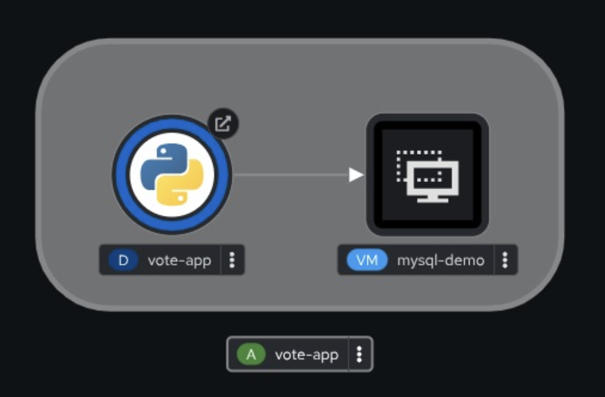

# WORK IN PROGRESS
to do:
- Include both a manual sync and auto-sync scenario.
- Add a Git change mid-workshop and show ArgoCD’s detection of drift.

# Workshop - Mixed Pod + VM OpenShift Virtualization GitOps Demo

GitOps is a way to manage infrastructure and applications using Git as the single source of truth.
It automates deployment by syncing the desired state in Git with the live environment.
Every change is tracked in Git, providing a full audit trail for transparency and accountability.

You can learn more about GitOps from this [GitOps Workshop Guide](https://openshiftdemos.github.io/openshift-gitops-workshop/openshift-gitops-workshop/index.html).

## Virt + GitOps Workshop

Use OpenShift Virtualization & GitOps to deploy a demo vote application pod and a MySQL VM.

Once the application is deployed this is what you will see in OpenShift's Topology View:



We will use the OpenShift GitOps Operator (based on the ArgoCD project) to implement GitOps and deploy our demo application. 

First, delete any of the resources that may have been created in the cluster due to previous labs.

## Find and access your Git Repo URL

Before we do anything, we need to take a look at your application manifests (yaml code) in our lab git server (Gitea), hosted on OpenShift.

Note that whenever you are working in the OpenShift Console, it is always very important to select the correct OpenShift project in the top left of the Console.  

Now, select the "Gitea" project.

Determine Gitea's Route which you will find in the Gitea namespace (Go to Menu -> Networking -> Routes).  

Log into Gitea using your username and password as provided by your lap proctors (these are usually the same as for the Virtualization Workshop). 

After logging into Gitea, note your repository (which is a copy of the source code of the original flask-vote-app) and fetch the repo URL.  

Your Git repo URL will look something like this (starting in "http" and ending in "flask-vote-app.git"):

```
http://gitea-with-repositories-gitea.apps.sandbox.openshift.com/user1/flask-vote-app.git
```

After you have logged in, you will see your repository with the name, e.g. "user1/flask-vote-app".

Look into the folder "deploy/vote-app-with-mysql-vm/direct" and open the file `vote-app-mysql-vm-all-in-one.yaml`.

In the file, you will see all the Kubernetes resources that are needed to deploy the application. 

Note the following definitions:

  - `kind: Deployment` (name: vote-app) - provisions the Python based vote-app in a pod
  - `kind: Service` (name: db) - provides a static name & IP to allow the pod to access the MySQL VM, via the pod network
  - `kind: VirtualMachine` - will provision the MySQL VM
  - `kind: Route` - will provide north-south ingress into the vote-app application pod

Later on in the workshop you will make changes to the code and see the changes take effect in OpenShift. 


## Create a new Project 

Create a new project for yourself to work in and remember the project name.  Use a unique name, e.g. `gitops-user1`

You can do this in the OpenShift Console under `Home -> Projects -> Create Project` or from the command line with "oc new-project my-project".

You will use this project for all further activities.


## Provision your own instance of OpenShift GitOps (ArgoCD)

First, you will provision your own instance of ArgoCD into your OpenShift namespace.

Add the following ArgoCD resource into your namespace.  There are many ways to do this, e.g. via the OpenShift Console or via the command line.

Don't forget to change the `YOUR-OPENSHIFT-NAMESPACE` in the yaml code to match your OpenShift namespace. 

```
apiVersion: argoproj.io/v1beta1
kind: ArgoCD
metadata:
  name: argocd
  namespace: YOUR-OPENSHIFT-NAMESPACE      # <<== Add your namespace here, e.g. gitops-user1
spec:
  controller:
    processors: {}
    resources:
      limits:
        cpu: "2"
        memory: 2Gi
      requests:
        cpu: 250m
        memory: 1Gi
    sharding: {}
  grafana:
    enabled: false
    ingress:
      enabled: false
    route:
      enabled: false
  ha:
    enabled: false
    resources:
      limits:
        cpu: 500m
        memory: 256Mi
      requests:
        cpu: 250m
        memory: 128Mi
  initialSSHKnownHosts: {}
  monitoring:
    enabled: false
  notifications:
    enabled: false
  prometheus:
    enabled: false
    ingress:
      enabled: false
    route:
      enabled: false
  rbac:
    defaultPolicy: ""
    policy: |
      g, system:authenticated, role:admin
      g, system:cluster-admins, role:admin
    scopes: '[groups, users]'
  redis:
    resources:
      limits:
        cpu: 500m
        memory: 256Mi
      requests:
        cpu: 250m
        memory: 128Mi
  repo:
    resources:
      limits:
        cpu: "1"
        memory: 1Gi
      requests:
        cpu: 250m
        memory: 256Mi
  resourceExclusions: "- apiGroups:\n  - tekton.dev\n  clusters:\n  - '*'\n  kinds:\n
    \ - TaskRun\n  - PipelineRun        \n"
  server:
    autoscale:
      enabled: false
    grpc:
      ingress:
        enabled: false
    ingress:
      enabled: false
    resources:
      limits:
        cpu: 500m
        memory: 256Mi
      requests:
        cpu: 125m
        memory: 128Mi
    route:
      enabled: true
    service:
      type: ""
  sso:
    dex:
      openShiftOAuth: true
      resources:
        limits:
          cpu: 500m
          memory: 256Mi
        requests:
          cpu: 250m
          memory: 128Mi
    provider: dex
  tls:
    ca: {}
```

In the Console, go to Workloads -> Pods (ensure your project is selected above).

After about 3-4 mins, you should see all the ArgoCD pods, running and ready (1/1), similar to the following: 

- argocd-application-controller-0
- argocd-dex-server-xxxxx-xxxxx
- argocd-redis-xxxxx-xxxxx
- argocd-repo-server-xxxxx-xxxxx
- argocd-server-xxxxx-xxxxx


Find the Route that was created and access it to open the ArgoCD UI at the login page.

Here is one way to find the ArgoCD Route from the command line.

```
oc get route -n YOUR-NAMESPACE argocd -o jsonpath='{.spec.host}{"\n"}'
```

The other way is to look at the main menu on the left under Networking -> Routes. 

The route should `look similar` to this one:

```
https://argocd-server-gitops-user1.apps.cluster-xxxxx.dynamic.redhatworkshops.io/
```

Open the URL in another tab and you will now see the ArgoCD UI in your browser.

Log into ArgoCD with your usual OpenShift credentials (use the `LOG IN VIA OPENSHIFT` button) and, on the next page, allow the `access permissions`.

Create the vote-app Application using the following Application resource (note, this will only work for clusters with direct access to the Internet).


## Create the Demo Application

In Argo CD, a managed set of Kubernetes manifests is called an Application. 
To enable Argo CD to deploy these manifests to your cluster, you need to define them using an `Application Custom Resource` (CR).

Let’s take a look at the Application manifest used for this deployment and break it down:


```
kind: Application
metadata:
  name: vote-app
  namespace: YOUR-OPENSHIFT-NAMESPACE             # <<== Add your namespace here, e.g. gitops-user1
spec:
  destination:
    namespace: YOUR-OPENSHIFT-NAMESPACE           # <<== Add your namespace here, e.g. gitops-user1
    server: https://kubernetes.default.svc

  project: default

  source:
    path: deploy/vote-app-with-mysql-vm/direct
    repoURL: http://HOST/YOUR-REPO-PATH.git       # <<== add your repo URL here
    targetRevision: HEAD

```
<!--
#  syncPolicy:
#    automated:
#      prune: true
#      selfHeal: false
-->

- `destination`: describes into which cluster and namespace to apply the yaml resources (using the locally-resolvable URL for the cluster)
- `project default`: is an ArgoCD concept and has nothing to do with OpenShift projects
- `source`: describes from which git repository and the directory path to fetch the yaml resources
- `prune`: resources, that have been removed from the Git repo, will be automatically pruned
- `selfHeal` false: manual changes made to the kubernetes resources, e.g. using oc or kubectl, will not be "healed"

Create the above Application by:

- Clicking on the "CREATE APPLICATION" button in the ArgoCD UI
- Click on the "EDIT AS YAML" button
- Copy and paste and then
- `Edit the yaml` as indicated above
- Click SAVE and then
- Click the CREATE button

`IMPORTANT: Be sure to change the values in the above Application manifest: both namespaces & repoURL`

Note that after the VM status is `Running` it will still `take up to 5 mins` for the MySQL VM to launch and run its `cloud-init` script to install, configure and run MySQL, 
after which the vote application will connect to the database and be ready to use.  

Using the Virtualization menu item, find and then log into the MySQL VM's Console and check the output of the cloud-init script.  
See the log file at /var/log/cloud-init-output.log.

Also, verify that MySQL is running in the VM with "ps -ef | grep -i mysql".  Bonus activity, if you know how, connect to MySQL and view the database contents.

## View the VM in the Console

Go and view your new MySQL VM in the Console.

Go to Administration -> Virtualization -> mysql-demo -> Configuration -> Initial Run -> Cloud-init Edit -> Script (toggle button) 
to view the cloud-init script which sets the demo user & password and also installs and configured MySQL.  This is the script that is run when the VM is started for the first time. 


## Self Healing

Notice that we set the following in the above yaml resource.  We set the application to NOT `self heal`.  Let's test this now. 

```
spec:
  syncPolicy:
    automated:
      prune: true
      selfHeal: false 
```

Since `selfHeal` was set to false, we will delete one of the kubernetes resources of the application.

Now, delete the vote-app route in your namespace. 

What happened? 

It does not get re-created automatically!  Why not? 
Answer: `Because the Application is not set to 'self heal'`.

Set selfHeal to "auto" in the ArgoCD UI.  Go to the Application, click `Details`, scroll down and make the change to self heal.  Click on ENABLE-AUTO-SYNC to enable it.  Ensure `PRUNE RESOURCES` and `SELF HEAL` are also enabled!

Go back to the main UI and you should see "Auto sync is enabled".

Now, make a very human mistake and delete some of the vote-app resources in your project. 

Make a change in OpenShift and see it "heal", for example: 

- Delete the route and/or
- Delete the vote-app Deployment and/or
- Stop the MySQL VM
- Delete the MySQL VM


## Implement Rollback

Imagine a change is rolled out via git by the platform team and then synced with OpenShift.

But, there is a problem!
- You can rollback to the previous revision (or git commit) that is known to work!

Via Gitea, make a change to the "vote-app-mysql-vm-all-in-one.yaml" file in your repo.  E.g. change the vote-app deployment `replicas` to "3", e.g. "replicas: 3".

Commit the change, by entering "Changed replicas = 3" into the `Subject` line of the commit. 

Ensure the Application is re-synchronized via the UI.

Now try out the "HISTORY AND ROLLBACK" button and change the configuration back to the previous one. 

You should be able to roll back to the previous state.

Note: See the [ArgoCD Core Concepts](https://argo-cd.readthedocs.io/en/stable/core_concepts/#core-concepts) for an explanation on the difference between `Refresh` and `Sync`.
- `Refresh` Compare the latest code in Git with the live state. Figure out what is different.
- `Sync` The process of making an application move to its target state. E.g. by applying changes to a Kubernetes cluster.


## Clean up 

Now delete the application.

On the ArgoCD UI, drill down into your Application tile, click on delete and watch all the resources be removed. 

## The End

That is the end of the Virt + GitOps workshop.  You have learned how to configure OpenShift GitOps (ArgoCD) and use it to provision and manage application 
in OpenShift, via Git.


