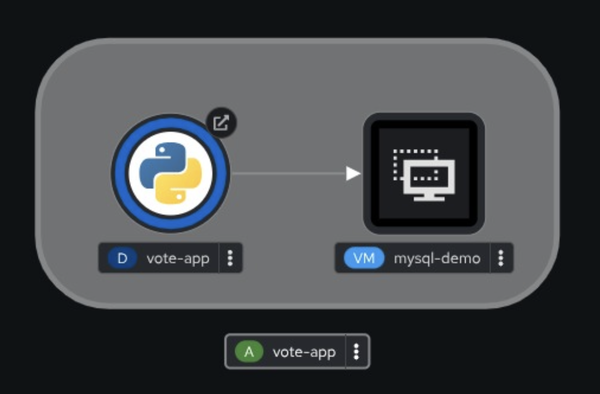
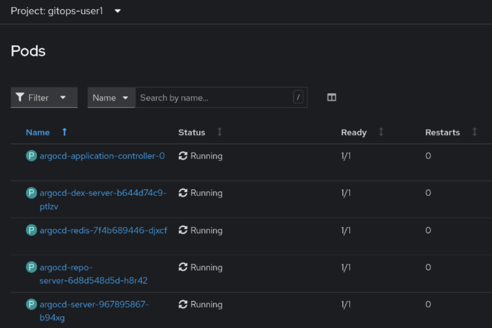
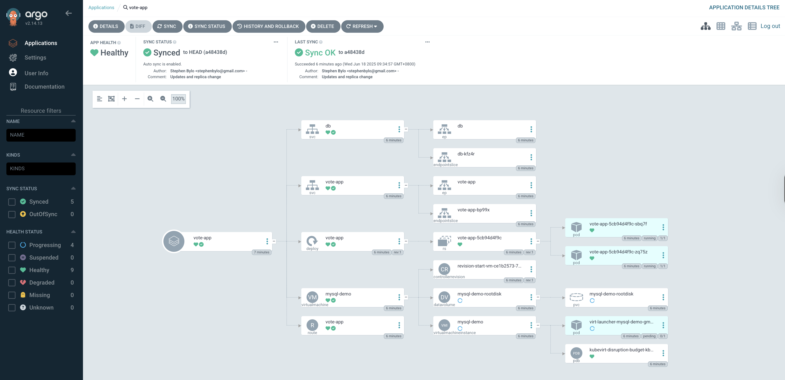
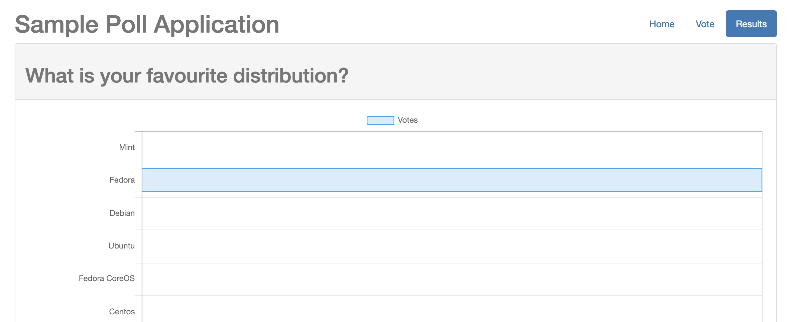

# Mixed Pod + VM OpenShift Virtualization GitOps Workshop

In this workshop, you will learn how to deploy a demo application that allows you and others to vote for your favorite Linux distribution. 
The "vote" application consists of a combination of pods and a MySQL VM running on OpenShift Virtualization, all of which are deployed via GitOps.

Running VMs and Pods together in OpenShift is helpful because:
- Some workloads can't be containerized due to several reasons, including legacy dependencies, specific OS requirements, or licensing restrictions.
- It enables infrastructure and skills consolidation, reducing hardware costs, simplifying operations,
and allowing teams to manage everything with a single platform and toolset.

GitOps is a method for managing infrastructure and applications, utilizing Git as the single source of truth for configuration management.
It automates deployment by syncing the desired state in Git with the live environment.
Every change is tracked in Git, providing a complete audit trail for transparency and accountability.

Once the application is deployed, this is what you will see in OpenShift's Topology View:



We will use the OpenShift GitOps Operator (read more at the [ArgoCD Project](https://argo-cd.readthedocs.io/)) to implement GitOps and deploy our vote application. 

Before starting, please delete any Virtual Machines created in previous labs you may have completed to free up cluster resources.


## Find and access your Git Repo URL

We will provision a vote application into OpenShift.  But, from what YAML code?
Before we proceed, we need to review your application manifests (YAML code) on our lab's Git server (Gitea).

> **Note:** Whenever you are working in the OpenShift Console, it is always essential to select the correct OpenShift project in the top left of the Console.  
> For example:
> 

Using the above selector, select the "Gitea" project in the OpenShift Console. 

Determine Gitea's Route, which you will find in the Gitea project (Go to `Menu -> Networking -> Routes`).  

Log in to Gitea using your username and password as provided by your lab proctors (these credentials are usually the same as for the OpenShift Virtualization Workshop). 

After logging into Gitea, note your repository (which is a copy of the original flask-vote-app's source code) and fetch the repository's URL.  
You will see your repository, which will have a name, e.g., "user1/flask-vote-app".

Your Git repo URL will look something like this (starting with "http://" and ending in "flask-vote-app.git").  Make a note of it:

```
http://gitea-gitea.apps.sandbox.openshift.com/user1/flask-vote-app.git
```

Look into the folder "deploy/vote-app-with-mysql-vm/direct" and open the file `vote-app-mysql-vm-all-in-one.yaml`.

In the file, you will find all the Kubernetes resource definitions required to deploy the complete vote application. 

Note the following definitions:

  - `kind: Deployment` (name: vote-app): provisions the Python-based vote-app in a pod
  - `kind: Service` (name: db): provides a static name & IP to allow the pod to access the MySQL VM, via the pod network
  - `kind: VirtualMachine`: will provision the MySQL VM
  - `kind: Route`: will provide north-south ingress into the vote-app application pod

Later on in the workshop, you will make changes to the code and see the changes take effect in OpenShift. 

`Before moving on to the next section, ensure you have made a note of the URL for your Gitea repository.  You will need it later!`


## Create a new Project 

Create a new project for yourself to work in and remember the project name.  Use a unique name, e.g., `gitops-user1` (you must change 'user1' to your username).

You can do this in the OpenShift Console under `Home -> Projects -> Create Project` or from the command line with "oc new-project gitops-user1" (remember to change 'user1' to your username!).
You can run the CLI commands in an `OpenShift command line terminal`.

> **Note**: You can access the command line (terminal) from the top right of the OpenShift Console, where you will see the ">_" icon.

`You will use the project you just created for all further activities.`


## Provision your instance of OpenShift GitOps (ArgoCD)

First, you will provision your instance of ArgoCD.

Add the following ArgoCD resource to your project (e.g., project gitops-user1).  

> Always ensure your project is selected!
> How to choose the project?  Select it at the top left of the OpenShift Console.

There are several ways to do this, for example, via the OpenShift Console (see the "+" icon in the top right) or via the command line.

Don't forget to change the `YOUR-OPENSHIFT-PROJECT` placeholder - to match your OpenShift project - after pasting the below YAML code.

```
apiVersion: argoproj.io/v1beta1
kind: ArgoCD
metadata:
  name: argocd
  namespace: YOUR-OPENSHIFT-PROJECT      # <<== Add your project here, e.g. gitops-user1
spec:
  controller:
    processors: {}
    resources:
      limits:
        cpu: "2"
        memory: 2Gi
      requests:
        cpu: 250m
        memory: 1Gi
    sharding: {}
  grafana:
    enabled: false
    ingress:
      enabled: false
    route:
      enabled: false
  ha:
    enabled: false
    resources:
      limits:
        cpu: 500m
        memory: 256Mi
      requests:
        cpu: 250m
        memory: 128Mi
  initialSSHKnownHosts: {}
  monitoring:
    enabled: false
  notifications:
    enabled: false
  prometheus:
    enabled: false
    ingress:
      enabled: false
    route:
      enabled: false
  rbac:
    defaultPolicy: ""
    policy: |
      g, system:authenticated, role:admin
      g, system:cluster-admins, role:admin
    scopes: '[groups, users]'
  redis:
    resources:
      limits:
        cpu: 500m
        memory: 256Mi
      requests:
        cpu: 250m
        memory: 128Mi
  repo:
    resources:
      limits:
        cpu: "1"
        memory: 1Gi
      requests:
        cpu: 250m
        memory: 256Mi
  resourceExclusions: "- apiGroups:\n  - tekton.dev\n  clusters:\n  - '*'\n  kinds:\n
    \ - TaskRun\n  - PipelineRun        \n"
  server:
    autoscale:
      enabled: false
    grpc:
      ingress:
        enabled: false
    ingress:
      enabled: false
    resources:
      limits:
        cpu: 500m
        memory: 256Mi
      requests:
        cpu: 125m
        memory: 128Mi
    route:
      enabled: true
    service:
      type: ""
  sso:
    dex:
      openShiftOAuth: true
      resources:
        limits:
          cpu: 500m
          memory: 256Mi
        requests:
          cpu: 250m
          memory: 128Mi
    provider: dex
  tls:
    ca: {}
```

In the Console, go to `Workloads -> Pods`.
After about 3-4 minutes, you should see all the ArgoCD pods running and ready (1/1), similar to the following: 



Find the Route that was created in `YOUR PROJECT` (e.g., gitops-user1) and access it to open the ArgoCD UI at the login page.

Here is one way to find the ArgoCD Route from the command line.

```
oc get route -n YOUR-PROJECT argocd-server -o jsonpath='{.spec.host}{"\n"}'
```

> **Note**: You can access the command line (terminal) from the top right of the OpenShift Console, where you will see the ">_" icon.

Another way to find the Route is to look at the main menu in the OpenShift Console, under `Networking -> Routes`. 

The Route should `look similar` to this one:

```
https://argocd-server-gitops-user1.apps.cluster-xxxxx.dynamic.redhatworkshops.io/
```

Open the URL in a separate browser tab to view the ArgoCD login page.

Use the `LOG IN VIA OPENSHIFT` button to log into ArgoCD with your user's OpenShift credentials.
> *DO NOT* use the `username` and `password` fields below it!

On the next page, allow the `access permissions`.

`In the next section, we will provision the vote-app Application.`


## Provision the Vote Application

In ArgoCD, a managed set of Kubernetes manifests is referred to as an `Application`. 
To enable ArgoCD to deploy these manifests to your cluster, you need to define them using an `Application` `Custom Resource` (CR).

Let’s take a look at the Application manifest used for this deployment and break it down:

```
kind: Application
metadata:
  name: vote-app
  namespace: YOUR-OPENSHIFT-PROJECT               # <<== Add your project here, e.g. gitops-user1
spec:
  destination:
    namespace: YOUR-OPENSHIFT-PROJECT             # <<== Add your project here, e.g. gitops-user1
    server: https://kubernetes.default.svc

  project: default                                # <<== NO NOT CHANGE ARGOCD PROJECT!

  source:
    path: deploy/vote-app-with-mysql-vm/direct
    repoURL: http://HOST/YOUR-REPO-PATH.git       # <<== add your vote-app repo URL here (Gitea)
    targetRevision: HEAD

  syncPolicy:
    automated:
      prune: true
      selfHeal: false
```

- `destination`: describes into which cluster and project to apply the YAML resources (using the locally-resolvable URL for the cluster)
- `project default`: is an ArgoCD concept and has nothing to do with OpenShift projects
- `source`: describes from which git repository, and the directory path, to fetch the YAML resources
- `prune`: resources that have been removed from the Git repo, will be automatically pruned
- `selfHeal` false: manual changes or deletions made to the Kubernetes resources will not be automatically "healed"

Create the above Application by:

- Clicking on the "CREATE APPLICATION" button in the ArgoCD UI
- Click on the "EDIT AS YAML" button
- Copy and paste the above `Application` YAML code and then
- `Edit the code` by changing the three values, as indicated above
- Click SAVE and then (note that all the fields in the form have now been populated from the YAML)
- Click the CREATE button to create the Application

> `IMPORTANT: Be sure to change the three values in the above Application manifest: both "namespaces" & "repoURL"`

You should see the provisioned application, which looks like this:



> **Note** that after the VM status is `Running`, it will still `take up to 5 mins` for the MySQL VM to run its `cloud-init` script to install, configure, and run MySQL, after which the vote application will connect to the database and be ready to use.  

- `Bonus activity`: Staying in the Administrator View, go to the `Virtualization -> VirtualMachines` menu item, find and then log into the MySQL VM's Console and check the output of the cloud-init script.  See the log file at /var/log/cloud-init-output.log.  Also, verify that MySQL is running in the VM with "ps -ef | grep -i mysql".  If you know how, connect to MySQL and view the contents of the database.

Now, locate the vote-app Route in your project (e.g., project gitops-user1) and open the application in your browser to verify that it is working.  You should be able to make a single vote and view the result. 

It should look like this:



`At this point, you should have the vote application up and running`


## View the VM in the OpenShift Console

Go and view your new MySQL VM in the OpenShift Console.

Go to `Administration -> Virtualization -> VirtualMachines -> mysql-demo -> Configuration -> Initial Run -> Cloud-init Edit -> Script (the toggle button)`
to view the cloud-init script, which sets the demo user & password and also installs and configures MySQL.  This is the script that is executed when the VM is started for the first time. 


## Self-Healing via GitOps

Notice that we set the following in the `Application` YAML resource above.  We set the application to NOT `self-heal`.  Let's test this now. 

```
spec:
  syncPolicy:
    automated:
      prune: true
      selfHeal: false 
```

Since `selfHeal` was set to false, if any application resource in OpenShift is deleted `it WILL NOT be` re-created automatically. 
We can try this out by deleting one of the Kubernetes resources for the application.

Now, delete the vote-app `route` in your project (e.g., project gitops-user1).  Note that this will cause the application to break and become inaccessible.

What happened? 

The Route resource is not re-created automatically!  Why not? 
Answer: `Because the Application is not set to 'self heal'` (as explained above). 

Set selfHeal to "auto" in the ArgoCD UI.  To do that, go to the Application, click `Details`, scroll down, and make the change to self-heal.  Click on ENABLE-AUTO-SYNC to enable it.  Ensure `PRUNE RESOURCES` and `SELF HEAL` are also enabled!

Return to the main ArgoCD UI and verify that "_Auto sync is enabled_" is displayed under "Sync status".

Now, make a very human mistake and delete some other vote-app resources in your project (e.g., project gitops-user1). 

Make a change in OpenShift and see how it's "healed" by ArgoCD, for example: 

- Delete the vote-app or the VM's Service resource and/or
- Delete the vote-app Deployment and/or
- Delete the Route again and/or
- Stop the MySQL VM

You should see those resources being re-instated, as defined in your Gitea repository (the desired state).

`Ensure the application is working again before moving on`

> **Note**: If you restarted or recreated the VM, you will need to bounce (or restart) the vote-app pods so they can re-connect!


## Implement Rollback

Imagine a change is rolled out by the platform team (via a change in Git) and then synced with OpenShift.

However, there is a problem - the change has caused an outage!
- You can rollback to the previous revision (or `git commit`), which is known to work!

Via Gitea, make a change to the "_vote-app-mysql-vm-all-in-one.yaml_" file in your Gitea repo by clicking on the `Edit File` button (to the right).  

Make the change by `removing the whole of the Route resource` at the very bottom of the file!

Delete all these lines:

```
apiVersion: route.openshift.io/v1
kind: Route
metadata:
  annotations:
    app.openshift.io/connects-to: '[{"apiVersion":"kubevirt.io/v1","kind":"VirtualMachine","name":"mysql-demo"}]'
    openshift.io/host.generated: "true"
  labels:
    app: vote-app
    app.kubernetes.io/component: vote-app
    app.kubernetes.io/instance: vote-app
    app.kubernetes.io/name: vote-app
    app.kubernetes.io/part-of: vote-app
    app.openshift.io/runtime-version: latest
  name: vote-app
spec:
  port:
    targetPort: 8080-tcp
  tls:
    insecureEdgeTerminationPolicy: Redirect
    termination: edge
  to:
    kind: Service
    name: vote-app
    weight: 100
  wildcardPolicy: None
```

At the bottom of the page, commit the change, after entering "Route deleted!" into the `Subject` line of the commit (this message will show up in ArgoCD soon).

Ensure the Application is automatically resynchronized via the UI.  

> **Note**: If Auto-Sync is not set, you may need to click on the `Sync` button.

Deleting the Route stops the application from working. Verify that it has now truly failed, as there is no way to access the application from outside OpenShift (since the ingress Route is missing).

Now, try out the "HISTORY AND ROLLBACK" button and change the configuration back to the previous working one.

You should be able to roll back to the previous state, and the application will start working correctly again. 

> **Note**: See the [ArgoCD Core Concepts](https://argo-cd.readthedocs.io/en/stable/core_concepts/#core-concepts) for an explanation on the difference between `Refresh` and `Sync`.
> - `Refresh` Compare the latest code in Git with the live state. Figure out what is different.
> - `Sync` The process of making an application move to its target state. E.g., by applying changes to a Kubernetes cluster.


## Optional: Other things you can try

In the OpenShift Console, change the MySQL VM core count or the memory size.  Will it be changed, or will it be reverted to the "source of truth", as defined in Git? 

In Git, modify the core count or memory size of the MySQL VM and observe the VM being upgraded.


## Clean up 

Now delete the application.

On the ArgoCD UI, drill down into your Application tile, click the `DELETE` button, and watch as all the resources are removed. 

You have reached the end of the Virt + GitOps workshop.  You have learned how to configure OpenShift GitOps (ArgoCD) and use it to provision and manage mixed (VM + Pod) applications
in OpenShift, via Git.

You can learn more about GitOps from this [GitOps Workshop Guide](https://openshiftdemos.github.io/openshift-gitops-workshop/openshift-gitops-workshop/index.html).
