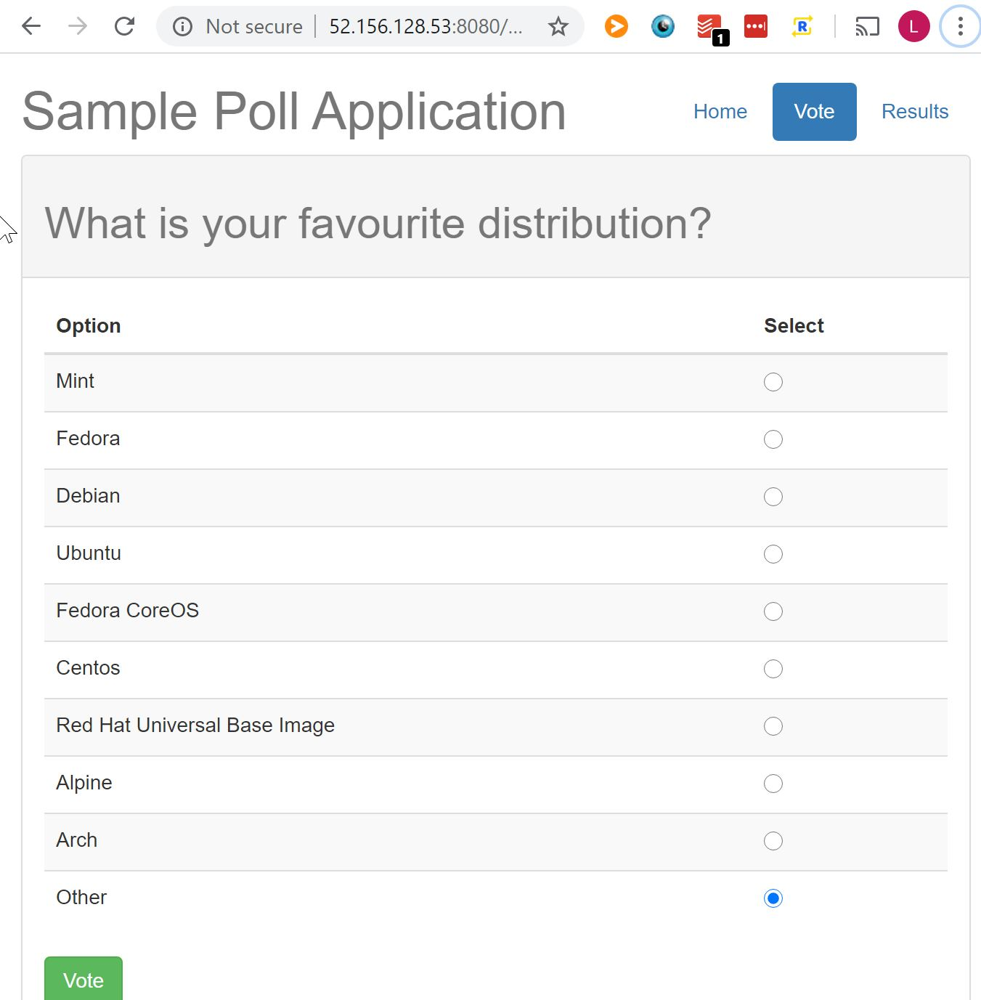
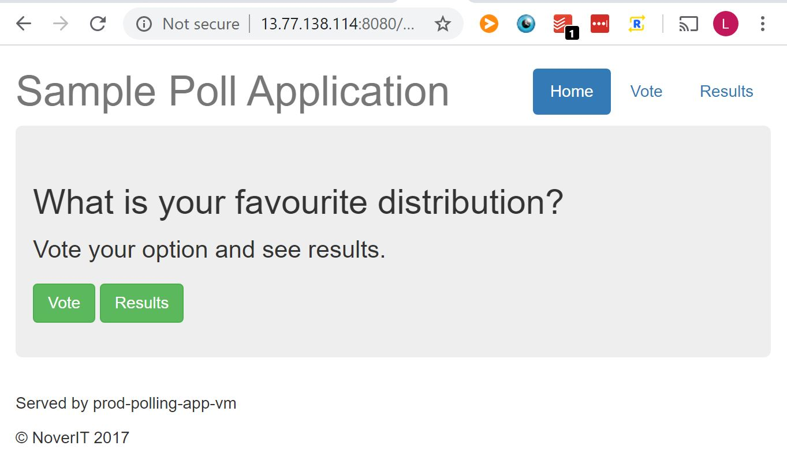

# How this Happened

I am cataloging the various steps that this "service" took to become "scalable".  I'll include shitty hand-drawn architecture diagrams that will hopefully help illustrate the point.

## 1: Initial Deployment

For this iteration, I'm doing something dumb.  I am deploying the entire stack on a single virtual azure machine.  Although this is not in any way "scalable" or "resilient", it will give a good example for how to set up many of the initial infrastructural components that are necessary for even running a deployment.  This process will allow me to deploy using solely the command line.  In future iterations, I will break out system components in such a way as to make the architecture scalable, then add resiliency and all of the other goodies that could be expected from a web service.

#### 1.1: Create working App

After forking a known good working "web service" with a front end, a webserver, and a backend, I stripped out all unnecessary functionality.  The service is designed as such:


This service is deployed manually on your local machine and requires a bit of setup to work.  For one, you have to configure a MySQL database such that the parameters defined in the `flask.rc` file.  You'll need a user with the correct permissions.  In order to deploy the app locally, once the db is configured, install dependencies using `pip install -r requirements.txt`, add env vars of `flask.rc` using `source ./flask.rc`, and deploy using `python app.py`.

#### 1.2: Create the Necessary Users and Groundwork on Azure

While AWS has a concept of roles and policies to manage RBAC, Azure uses a hierarchical model where resources are organized into `Management Groups > Subscriptions > Resources Groups > Resources`.  For the purposes here, I'm going to assume that I'm creating a application that would fall under a resource group that uses resources.  So I'm going to skip creating infrastructure for a management group or a subscription.

##### 1.2.1: Resource Group

Within the Azure Portal, I provisioned a Resource Group using the wizard:


##### 1.2.2: Virtual Machine + Others

I provisioned a Linux VM using Ubuntu 18.04 and the Azure "B1LS" tier machine.  I kept most of the default settings, but one critical setting changed was networking.  I created a new security group which allowed incoming traffic on both ports 22 and 8080 such that the app could be accessed from the public internet and the instance could be SSH'd into.  A New SSH key was created.  When provisioning via a bot user as I will eventually do, there will have to be an existing bot SSH key that is used for provisioning, but for now, I'm likely going to need to do some troubleshooting from the command line.

##### 1.2.3: MySQL

Create a managed MySQL instance from the Azure portal.  It'll ask for configuration like username and password, be sure to write these down as you'll need them in your flask.rc.  I only used the most basic tier to stay within cost limits (~30$/mo, which is within my trial credits).  This is done using the Azure for MySQL managed solution.  When setting up the DB, I had to write down the hostname of the MySQL Instance, as well as the Username and Password that I created.  

I had to remember to add the IP address of the VM that I created to the MySQL instance firewall rules.  I also had to manually create the database that I wanted to use as well as grant privileges to the username who I created.

`CREATE DATABASE PollingAppDb;`

`GRANT ALL PRIVILEGES ON PollingAppDb.* TO '<user>'@'<host>';`

##### 1.3: Install and Run Service

From here I SSH'd into the instance using the key pair that was created and the public IP address provisioned.  I used git to clone a known good version of the service from github and set it up in a local directory.  In order to install dependencies, I had to manually install pip3 and libmysqlclient-dev with `sudo apt update && sudo apt install libmysqlclient-dev python3-pip -y`.  This is already a pain in the ass.  Wouldn't it be nice if there was a way that software could provision all of this for me...?

At this point, I have a running and publicly accessible website that is attached to the MySQL backend.  I have an open public IP that can be accessed through the 8080 port, and the front end can talk to the backend!  Scalability achieved!  Here's what the architecture looks like at this point:


And a screenshot of the website in action:


But can we do better...

## 2: Repeatable Infrastructure

Now let's create an Infrastructure-as-Code definition of our service.  This way, we will have an actual declarative version of what our infrastructure __should__ look like, which will hopefully allow tooling to automatically manage it.  Also, it's a heckuva lot easier to run a few command line options than it is to go through the portal over and over again.  This will also allow us to quickly create test environments or other versions of our service that might be useful.

#### 2.1: Gather Data

For the service, we'll need two essential pieces of infrastructure at this point: The VM and the MySQL DB.  I took some notes and jotted down the specs of each of the instances such that I could define them in code later.

#### 2.2: Terraform Setup

For my IaC provider, I'm using [terraform](https://www.terraform.io/) because I'm familiar with it for AWS.  Azure may have a native solution that is preferable, but I'm not going to be using it right now.  After logging into to azure with my default credentials from the command line with `az login`, I make sure that terraform can communicate with Azure from my local machine by [running some basic scripts found here](https://www.terraform.io/docs/providers/azurerm/guides/azure_cli.html).

#### 2.3: Terraform Definitions

Now I will begin to define each aspect of the infrastructure in code using [Terraform's Azure Provider](https://www.terraform.io/docs/providers/azurerm/).

##### 2.3.1: Resource Group

Terraform requires that a resource group be defined in order to encapsulate all the resources that are used when creating your service.  I used a very basic definition which is more or less lifted straight from the documentation.

```
provider "azurerm" {
  version = "=2.15.0"
  features {}
}

resource "azurerm_resource_group" "polling_app" {
  name     = "prod_polling_app"
  location = "westus2"
}
```

I am prefixing everything with "prod" for now, assuming that I'll refactor out a vars file later which can then differentiate between prod and test.  However, because I'm an optimistic developer thus far, I only have a prod environment! What could go wrong.

##### 2.3.2: Networking

I need to create the virtual networking as well as the security rules that allow traffic from the outside world.  This involves creating a virtual network, a subnet within that network for my app and DB, a public IP address to be assigned to my VM, a network interface so my app can be exposed to networking, a security group to allow traffic on specific ports and from specific locations, and an association between my network interface and my security group.

```
resource "azurerm_virtual_network" "polling_app_virt_net" {
  name                = "prod_polling_app_virt_net"
  address_space       = ["10.0.0.0/16"]
  location            = azurerm_resource_group.polling_app.location
  resource_group_name = azurerm_resource_group.polling_app.name
}

resource "azurerm_subnet" "polling_app_virt_net_subnet" {
  name                 = "prod_polling_app_virt_net_subnet"
  resource_group_name  = azurerm_resource_group.polling_app.name
  virtual_network_name = azurerm_virtual_network.polling_app_virt_net.name
  address_prefixes     = ["10.0.2.0/24"]
}

resource "azurerm_public_ip" "polling_app_public_ip" {
  name                = "prod_polling_app_public_ip"
  location            = azurerm_resource_group.polling_app.location
  resource_group_name = azurerm_resource_group.polling_app.name
  allocation_method   = "Dynamic"
}

resource "azurerm_network_interface" "polling_app_network_interface" {
  name                = "prod_polling_app_network_interface"
  location            = azurerm_resource_group.polling_app.location
  resource_group_name = azurerm_resource_group.polling_app.name

  ip_configuration {
    name                          = "internal"
    subnet_id                     = azurerm_subnet.polling_app_virt_net_subnet.id
    private_ip_address_allocation = "Dynamic"
    public_ip_address_id          = azurerm_public_ip.polling_app_public_ip.id
  }
}

resource "azurerm_network_security_group" "polling_app_security_group" {
  name                = "prod_polling_app_nsg"
  location            = azurerm_resource_group.polling_app.location
  resource_group_name = azurerm_resource_group.polling_app.name

  security_rule {
    name                       = "allow_ssh"
    priority                   = 100
    direction                  = "Inbound"
    access                     = "Allow"
    protocol                   = "Tcp"
    source_port_range          = "*"
    destination_port_range     = "22"
    source_address_prefix      = "*"
    destination_address_prefix = "*"
  }

  security_rule {
    name                       = "allow_8080_in"
    priority                   = 200
    direction                  = "Inbound"
    access                     = "Allow"
    protocol                   = "Tcp"
    source_port_range          = "*"
    destination_port_range     = "8080"
    source_address_prefix      = "*"
    destination_address_prefix = "*"
  }

  security_rule {
    name                       = "allow_vnet"
    priority                   = 300
    direction                  = "Inbound"
    access                     = "Allow"
    protocol                   = "Tcp"
    source_address_prefix      = "VirtualNetwork"
    destination_address_prefix = "VirtualNetwork"
    source_port_range          = "*"
    destination_port_range     = "*"
  }

  security_rule {
    name                       = "allow_load_balancer"
    priority                   = 400
    direction                  = "Inbound"
    access                     = "Allow"
    protocol                   = "Tcp"
    source_address_prefix      = "AzureLoadBalancer"
    destination_address_prefix = "*"
    source_port_range          = "*"
    destination_port_range     = "*"
  }

  security_rule {
    name                       = "allow_3306_out"
    priority                   = 500
    direction                  = "Outbound"
    access                     = "Allow"
    protocol                   = "*"
    source_port_range          = "*"
    destination_port_range     = "3306"
    source_address_prefix      = "*"
    destination_address_prefix = "*"
  }
}

resource "azurerm_network_interface_security_group_association" "polling_app_nsg_association" {
  network_interface_id      = azurerm_network_interface.polling_app_network_interface.id
  network_security_group_id = azurerm_network_security_group.polling_app_security_group.id
}
```

Once again, a lot of this leaves some refactoring on the table.  I should be separating out a lot of the values of resources into variables, but dammit I'm focused on Minimum Viable Product! The clock is ticking!

##### 2.3.3: Virtual Machine

The last piece of the VM puzzle is the machine itself.  Plugging in a small and cheap machine type with a small amount of storage is fine.  In order to be able to connect to the machine, generate a local ssh key pair:

`$ ssh-keygen -t rsa -b 4096 -f ~/.ssh/azure/id_rsa`

Then plug in the public key along with all the other useful things created above to finish creating the VM:

```
resource "azurerm_linux_virtual_machine" "polling_app_vm" {
  name                = "prod-polling-app-vm"
  resource_group_name = azurerm_resource_group.polling_app.name
  location            = azurerm_resource_group.polling_app.location
  size                = "Standard_B1ls"
  admin_username      = var.admin_user
  network_interface_ids = [
    azurerm_network_interface.polling_app_network_interface.id,
  ]

  admin_ssh_key {
    username   = var.admin_user
    public_key = file("~/.ssh/azure/id_rsa.pub")
  }

  os_disk {
    caching              = "ReadWrite"
    storage_account_type = "Standard_LRS"
  }

  source_image_reference {
    publisher = "Canonical"
    offer     = "UbuntuServer"
    sku       = "18.04-LTS"
    version   = "latest"
  }
}
```

Assuming no major issues, these resources can be spun up and torn down using `terraform apply` and `terraform destroy`.  This is an immense improvement!  From here, we can spin up a VM that is what we need with a single command.  From there, we can ssh into that instance and begin the process of cloning the repo, and pulling up the service using the command line in our newly provisioned VM instance.  

(once you're ssh'd in)
```
$ sudo apt-get update
$ sudo apt-get install python3-pip libmysqlclient-dev -y
$ git clone https://github.com/loganballard/flask-vote-app/
$ cd flask-vote-app/
$ sudo python3 -m pip install -r requirements.txt
$ sudo python3 app.py
```

Or something of the like.  However, having to install things manually is still a pain in the ass.  Maybe we can tackle that later.... In the meantime, we've got to spin up a managed MySQL instance to house the database for this service.

##### 2.3.4: MySQL DB

Creating the SQL DB is a two-part affair.  Once again, we'll have to create an actually managed instance for the DB itself, but we'll also have to configure some networking rules such that our DB can be talked to by our VM instance.  First we need the actual MySQL instance, which is a fairly straightforward definition:

```
resource "azurerm_mysql_server" "polling_app_db" {
  name                = "prod-polling-app-db-v1"
  location            = azurerm_resource_group.polling_app.location
  resource_group_name = azurerm_resource_group.polling_app.name

  administrator_login          = var.mysql_admin_username
  administrator_login_password = var.mysql_admin_password

  sku_name   = "B_Gen5_1"
  storage_mb = 5120
  version    = "5.7"

  auto_grow_enabled                 = false
  backup_retention_days             = 7
  geo_redundant_backup_enabled      = false
  infrastructure_encryption_enabled = true
  public_network_access_enabled     = true
  ssl_enforcement_enabled           = true
  ssl_minimal_tls_version_enforced  = "TLS1_2"
}
```

In real life, we'd probably want to have some sort of replication, but again, MVP!  The sprint is almost over!  Another thing that's interesting about this particular part of the process is that I've used my first [terraform variable](https://www.terraform.io/docs/configuration/variables.html) to shield the mysql username and password from source control.  This means defining them in the `prod.tfvars` file.  But not committing them to the repository!

The other part of the DB is the firewall rules.  This will allow our VM to talk to the MySql DB.

```
resource "azurerm_mysql_firewall_rule" "polling_app_db_firewall" {
  name                = "prod_polling_app_firewall"
  resource_group_name = azurerm_resource_group.polling_app.name
  server_name         = azurerm_mysql_server.polling_app_db.name
  start_ip_address    = azurerm_linux_virtual_machine.polling_app_vm.public_ip_address
  end_ip_address      = azurerm_linux_virtual_machine.polling_app_vm.public_ip_address
}
```

That should be all!  Now we can create infrastructure using `terraform apply --var-file=prod.tfvars` and everything should spin up without too much of a struggle.  If it all goes successfully, the IP address of the VM and the [FQDN](https://kb.iu.edu/d/aiuv#:~:text=A%20fully%20qualified%20domain%20name,be%20mymail.somecollege.edu%20.) of the MySQL DB should be spit out to the command line.

##### 2.3.5: Manual Configuration

Now that we have the ability to deploy from the command line, we have to SSH into the instance and set everything up.  We did something similar before but now we'll have to do something a bit more advanced to connect our instance to MySQL.

Once you're ssh'd in to your VM using it's IP and your ssh key...
```
$ sudo apt-get update
$ sudo apt-get install python3-pip libmysqlclient-dev mysql-client-core-5.7 -y
$ git clone https://github.com/loganballard/flask-vote-app/
$ cd flask-vote-app/
$ sudo python3 -m pip install -r requirements.txt
// NOTE: azure requires that username be in the form username@dbname, which is the first part of the FQDN
$ mysql -h <your fqdn> -u <your username>@<first part of fqdn> -p'<your password>' 
// create the polling db in mysql
$ mysql> CREATE DATABASE <db name>;
# mysql> \q;
// create the flask.rc file according to your MySQL DB specs ...
$ source flask.rc
$ sudo -E python3 app.py
```
...or something of the like.  You should be able to use your web browser to navigate to `<your VM's ip>:8080` and see your website running!



Even though provisioning our infrastructure is easy and repeatable, configuring it is still a pain in the ass. We have to manually install dependencies, clone a repo, and configure a database. Can we do better?

## 3: Configuration Management

While spinning up the actual resources for the service is now under control, it is still a fairly manual process involving the command line to deploy the infrastructure, then ssh to actually connect to the instance, then a bunch of manual steps to install packages, updates, code, etc.  We should use config management to actually configure the service such that we can deploy without configuring anything manually.  [Enter Ansible.](https://www.ansible.com/)  Ansible allows us to declare what we want our configuration to look like, then automatically configure our provisioned resources from the command line.

#### 3.1: Setup

In addition to installing the Ansible CLI on your local machine, Ansible requires that a host is set up before it can be configured.  In order to do this, I created a `hosts` file with the IP address spit out by terraform when it was provisioned:

```
[webserver]
<IP ADDRESS FROM TF>
```

From there, I laid out the different steps that would need to be fulfilled before a host could be considered "configured".  Fortunately, it's already documented in section 2.3.5: Manual Configuration!  Basically, I need to:

- Create Env Var files
- Install system-wide dependencies
- Install python-specific dependencies
- Create a database on MySQL server
- Set up necessary environment variables
- Start the polling app service

I'll create a playbook that encompasses all those tasks to allow configuration to happen automatically!

The entire ansible process will use a few commonalities.  For one, the majority of the tasks should be run as my created `adminuser` from Terraform.  Things'll be installed in the `/home/adminuser/` directory.  This user is also whose SSH key is used to connect to the instance.  In addition, we'll want to use python3 (because ansible is stubbornly backwards-compatible, python2 is still unfortunately compatible).  Those settings are configured in the `main.yaml` and `vars/vars.yaml` files, among some other settings.

#### 3.2: Create Env Var Files

Ansible needs the different environment variables that we've configured our service to use.  Things like the MySQL database credentials, DB name, etc.  In the ansible configuration, there's examples of the environment variables in `./ops/ansible/roles/webserver/vars` that will need to be set.  For now, I'm configuring this manually to match the terraform values that are set in `./ops/terraform/prod.tfvars` as well as `./flask.rc`.  I wonder if there's a way to automate the configuration such that terraform and ansible are fed these variables by a service? Stay tuned...

For now, manually create the `env.yaml` file from the `env.yaml.example` file filling in the correct parameters.  These should match the `flask.rc` file.

#### 3.3: Installing Dependencies

We need to be able to install things with python, have MySQL compatibility, as well as have the mysql command-line tools.  In addition, we want to run Python in a virtualenv such that a system service can run it without having to reinstall dependencies.  In order to do that, we used provided Ansible modules:

```
- name: Install python3-pip, mysql
  apt:
    name: ["python3-pip", "libmysqlclient-dev", "mysql-client-core-5.7"]
    state: present
    update_cache: yes
  become: yes
  
- name: Install pip virtualenv
  pip:
    name: virtualenv
    executable: pip3
  become: yes
```

These two tasks will install the necessary apt packages as well as the `virtualenv` python package.  Nice!

#### 3.4: Repo-specific Setup

##### 3.4.1: Dependencies

From here, we want to check out the code for this repository from github so we can actually run it!  We'll also install a virtualenv and install all the dependencies into that virtual env.

```
- name: Copy the code from repository
  git:
    repo: "{{ repository }}"
    dest: /home/adminuser/flask-vote-app
    force: yes      

- name: Install pip dependencies
  pip:
    requirements: /home/adminuser/flask-vote-app/requirements.txt
    virtualenv: /home/adminuser/venv
```

##### 3.4.2: MySQL Setup

Ansible needs to load the environment vars from the `env.yaml` file.  From there, it'll create the database that we need to actually store the results of the poll:

```
- name: include the environment vars necessary for running the script
  include_vars:
    file: env.yaml
    name: mysql_vars

- name: configure database
  command: "/usr/bin/mysql -h {{ mysql_vars.DB_HOST }} -u {{ mysql_vars.DB_USER }} -p'{{ mysql_vars.DB_PASS }}' -e 'CREATE DATABASE IF NOT EXISTS {{ mysql_vars.DB_NAME }};'"
```

So much easier than doing it manually!

#### 3.5 Creating Service

From here, instead of running things as a command-line tool, which opens us up to all sorts of problems, lets instead run things as a [systemd Service](https://www.freedesktop.org/software/systemd/man/systemd.service.html).  This will make everything much more resilient and managed by a reliable process.  We define a basic unit service file:

```
[Unit]
Description=Polling App

[Service]
Restart=on-failure
RestartSec=5s

ExecStart=/home/adminuser/venv/bin/python3.6 /home/adminuser/flask-vote-app/app.py
EnvironmentFile=/var/local/env_vars

[Install]
WantedBy=multi-user.target
```

We'll also have to load the `env_vars` referenced in the `EnvironmentFile` parameter in the service.  In order to do that without exposing secrets to source control, we make a [jinja2 template](https://jinja.palletsprojects.com/en/2.11.x/) that ansible will automatically populate with variables that we loaded into the `mysql_vars` dictionary in the previous step:

```
DB_HOST={{ mysql_vars.DB_HOST }}
DB_PORT={{ mysql_vars.DB_PORT }}
DB_NAME={{ mysql_vars.DB_NAME }}
DB_USER={{ mysql_vars.DB_USER }}
DB_PASS={{ mysql_vars.DB_PASS }}
DB_TYPE=mysql
ENDPOINT_ADDRESS={{ mysql_vars.ENDPOINT_ADDRESS }}
PORT={{ mysql_vars.PORT }}
MASTER_USERNAME={{ mysql_vars.MASTER_USERNAME }}
MASTER_PASSWORD={{ mysql_vars.MASTER_PASSWORD }}

```

So we load the correct variables, install the service file, then tell `systemd` to start the service.

```
- name: install app service env_vars file
  template:
    src: templates/env_vars.j2
    dest: /var/local/env_vars
    owner: root
    mode: '0644'
  become: yes

- name: install polling app system service
  copy:
    src: service/pollingapp.service
    dest: /etc/systemd/system/pollingapp.service
    owner: root
    mode: '0644'
  become: yes

- name: start polling app service
  systemd:
    name: pollingapp
    state: started
    enabled: yes
    daemon_reload: yes
  become: yes
```

We now have a fully-fledged playbook that can be run from the command line once our infrastructure is provisioned.  The playbook will use our existing SSH key to SSH into the VM instance created by terraform, run all the necessary configuration, and start up our polling app service, all with (minimal) manual configuration.

#### 3.6: Running Ansible

From here, all that remains is to actually run the ansible CLI from our local machine. Because this is a playbook, I'll use the `ansible-playbook` binary.  I have to tell it which host to use as well as where my SSH key is stored in order for the CLI to connect to the provisioned VM.  From the `./ops/ansible` directory:

`$ ansible-playbook -i hosts --private-key ~/.ssh/azure/id_rsa main.yaml`

Note: to skip the validation for the unknown host ssh message, run this instead:

`$ ANSIBLE_HOST_KEY_CHECKING=False ansible-playbook -i hosts --private-key ~/.ssh/azure/id_rsa main.yaml`

This command tells ansible to run the playbook `main.yaml` against the hosts in the `hosts` file (just the one, for now), using the specified private key.  If everything works, you should be able to use your service by visiting the IP in the web browser and taking the poll!

.

### 3.7 Recap

This is a lot better!  We started out by provisioning everything manually on the Azure Portal, then doing all configuration management manually through SSH.  Now the process looks more like this:

- Run `terraform apply`
- Collect terraform outputs (IP and FQDN)
- Create Ansible variable files
- Run `ansible-playbook`

This is a DRASTIC improvement as we've added idempotent infrastructure and configuration management.  A multiple-hour provisioning process is now down to just a couple minutes to go from nothing to a running service!  We must be done!

#### 3.8: We're not actually done

There are few steps that I'd like to improve on from here.  The list from above contains two steps that still involve manual intervention:

- Run `terraform apply`
- **Collect terraform outputs (IP and FQDN)**
- **Create Ansible variable files**
- Run `ansible-playbook`

There has to be a way that we can automatically tie these two steps into each other.  Even though we are crushing it, can we do better?
