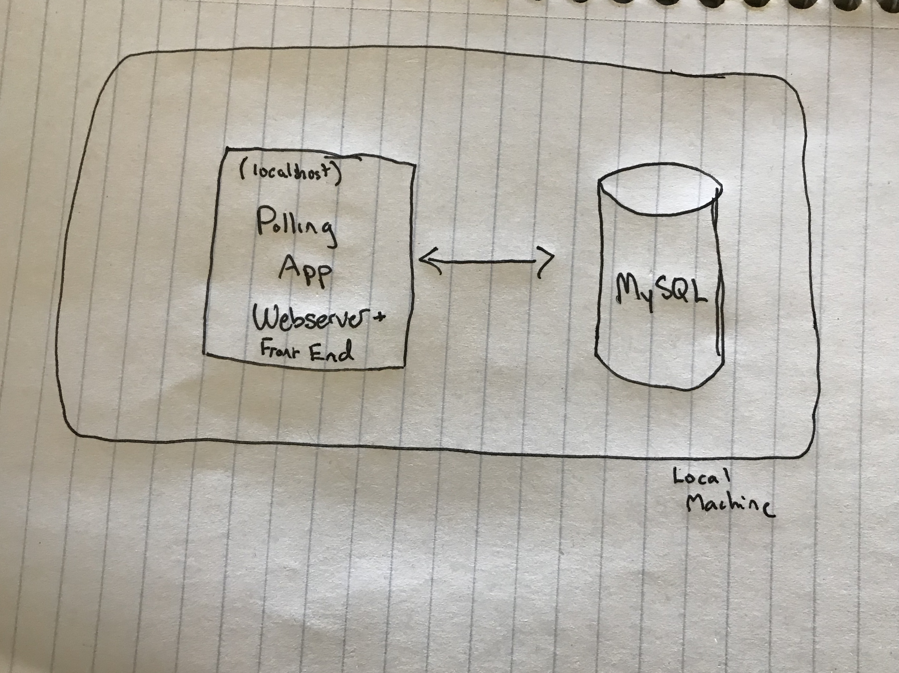
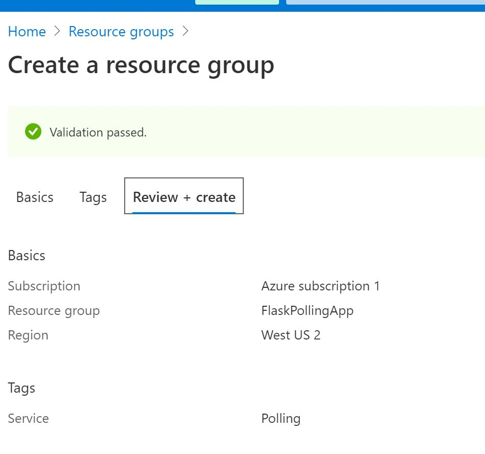
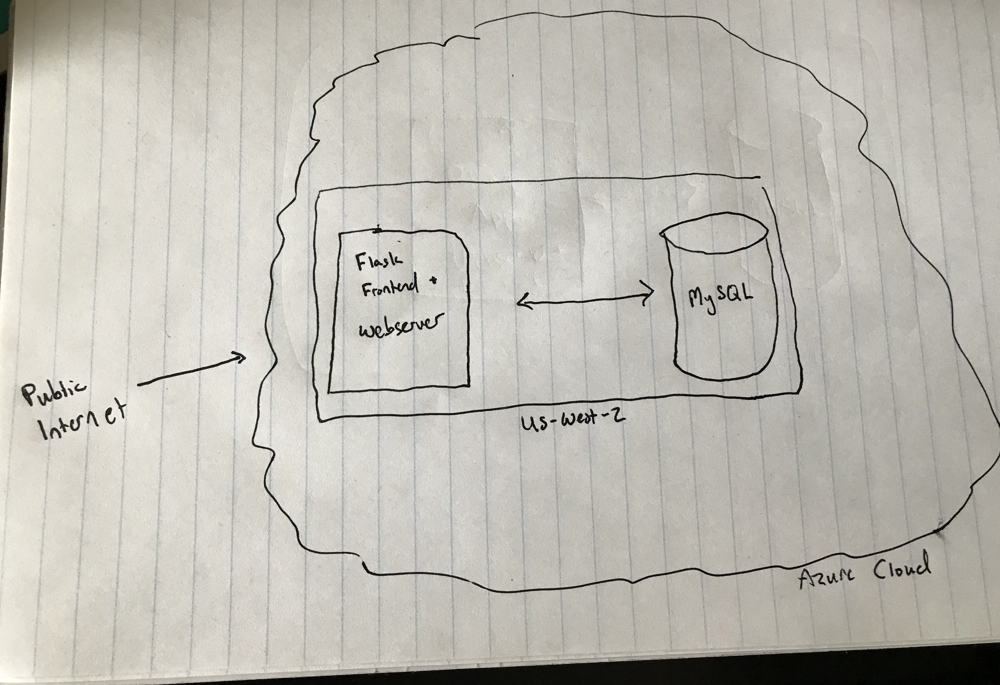
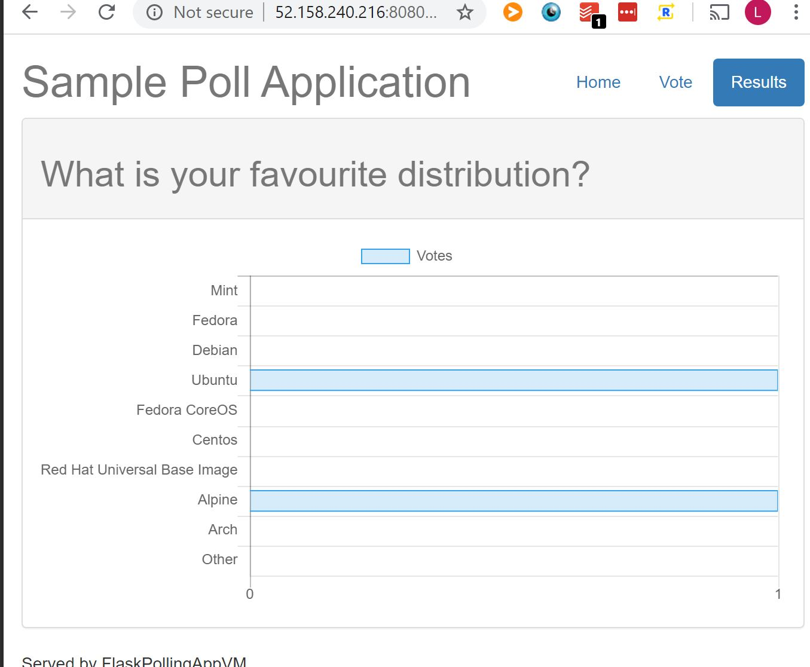

# How this Happened

I am cataloging the various steps that this "service" took to become "scalable".  I'll include shitty hand-drawn architecture diagrams that will hopefully help illustrate the point.

## 1: Initial Deployment

For this iteration, I'm doing something dumb.  I am deploying the entire stack on a single virtual azure machine.  Although this is not in any way "scalable" or "resilient", it will give a good example for how to set up many of the initial infrastructural components that are necessary for even running a deployment.  This process will allow me to deploy using solely the command line.  In future iterations, I will break out system components in such a way as to make the architecture scalable, then add resiliency and all of the other goodies that could be expected from a web service.

#### 1.1: Create working App

After forking a known good working "web service" with a front end, a webserver, and a backend, I stripped out all unnecessary functionality.  The service is designed as such:



This service is deployed manually on your local machine and requires a bit of setup to work.  For one, you have to configure a MySQL database such that the parameters defined in the `flask.rc` file.  You'll need a user with the correct permissions.  In order to deploy the app locally, once the db is configured, install dependencies using `pip install -r requirements.txt`, add env vars of `flask.rc` using `source ./flask.rc`, and deploy using `python app.py`.

#### 1.2 Create the Necessary Users and Groundwork on Azure

While AWS has a concept of roles and policies to manage RBAC, Azure uses a hierarchical model where resources are organized into `Management Groups > Subscriptions > Resources Groups > Resources`.  For the purposes here, I'm going to assume that I'm creating a application that would fall under a resource group that uses resources.  So I'm going to skip creating infrastructure for a management group or a subscription.

##### 1.2.1 Resource Group

Within the Azure Portal, I provisioned a Resource Group using the wizard:



##### 1.2.2 Virtual Machine + Others

I provisioned a Linux VM using Ubuntu 18.04 and the Azure "B1LS" tier machine.  I kept most of the default settings, but one critical setting changed was networking.  I created a new security group which allowed incoming traffic on both ports 22 and 8080 such that the app could be accessed from the public internet and the instance could be SSH'd into.  A New SSH key was created.  When provisioning via a bot user as I will eventually do, there will have to be an existing bot SSH key that is used for provisioning, but for now, I'm likely going to need to do some troubleshooting from the command line.

##### 1.2.3 MySQL

Create a managed MySQL instance from the Azure portal.  It'll ask for configuration like username and password, be sure to write these down as you'll need them in your flask.rc.  I only used the most basic tier to stay within cost limits (~30$/mo, which is within my trial credits).  This is done using the Azure for MySQL managed solution.  When setting up the DB, I had to write down the hostname of the MySQL Instance, as well as the Username and Password that I created.  

I had to remember to add the IP address of the VM that I created to the MySQL instance firewall rules.  I also had to manually create the database that I wanted to use as well as grant privileges to the username who I created.

`CREATE DATABASE PollingAppDb;`

`GRANT ALL PRIVILEGES ON PollingAppDb.* TO '<user>'@'<host>';`

##### 1.3 Install and Run Service

From here I SSH'd into the instance using the key pair that was created and the public IP address provisioned.  I used git to clone a known good version of the service from github and set it up in a local directory.  In order to install dependencies, I had to manually install pip3 and libmysqlclient-dev with `sudo apt update && sudo apt install libmysqlclient-dev python3-pip -y`.  This is already a pain in the ass.  Wouldn't it be nice if there was a way that software could provision all of this for me...?

At this point, I have a running and publicly accessible website that is attached to the MySQL backend.  I have an open public IP that can be accessed through the 8080 port, and the front end can talk to the backend!  Scalability achieved!  Here's what the architecture looks like at this point:



And a screenshot of the website in action:



But can we do better...

## 2: Repeatable Infrastructure

Now let's create an Infrastructure-as-Code definition of our service.  This way, we will have an actual declarative version of what our infrastructure __should__ look like, which will hopefully allow tooling to automatically manage it.  Also, it's a heckuva lot easier to run a few command line options than it is to go through the portal over and over again.  This will also allow us to quickly create test environments or other versions of our service that might be useful.

#### 2.1 Gather Data

For the service, we'll need two essential pieces of infrastructure at this point: The VM and the MySQL DB.  I took some notes and jotted down the specs of each of the instances such that I could define them in code later.

#### 2.2 Terraform Setup

For my IaC provider, I'm using [terraform](https://www.terraform.io/) because I'm familiar with it for AWS.  Azure may have a native solution that is preferable, but I'm not going to be using it right now.  After logging into to azure with my default credentials from the command line with `az login`, I make sure that terraform can communicate with Azure from my local machine by [running some basic scripts found here](https://www.terraform.io/docs/providers/azurerm/guides/azure_cli.html).

#### 2.3 Terraform Definitions

Now I will begin to define each aspect of the infrastructure in code using [Terraform's Azure Provider](https://www.terraform.io/docs/providers/azurerm/).

##### 2.3.1 Resource Group

Terraform requires that a resource group be defined in order to encapsulate all the resources that are used when creating your service.  I used a very basic definition which is more or less lifted straight from the documentation.

```
provider "azurerm" {
  version = "=2.15.0"
  features {}
}

resource "azurerm_resource_group" "polling_app" {
  name     = "prod_polling_app"
  location = "westus2"
}
```

I am prefixing everything with "prod" for now, assuming that I'll refactor out a vars file later which can then differentiate between prod and test.  However, because I'm an optimistic developer thus far, I only have a prod environment! What could go wrong.

##### 2.3.2 Networking

I need to create the virtual networking as well as the security rules that allow traffic from the outside world.  This involves creating a virtual network, a subnet within that network for my app and DB, a public IP address to be assigned to my VM, a network interface so my app can be exposed to networking, a security group to allow traffic on specific ports and from specific locations, and an association between my network interface and my security group.

```
resource "azurerm_virtual_network" "polling_app_virt_net" {
  name                = "prod_polling_app_virt_net"
  address_space       = ["10.0.0.0/16"]
  location            = azurerm_resource_group.polling_app.location
  resource_group_name = azurerm_resource_group.polling_app.name
}

resource "azurerm_subnet" "polling_app_virt_net_subnet" {
  name                 = "prod_polling_app_virt_net_subnet"
  resource_group_name  = azurerm_resource_group.polling_app.name
  virtual_network_name = azurerm_virtual_network.polling_app_virt_net.name
  address_prefixes     = ["10.0.2.0/24"]
}

resource "azurerm_public_ip" "polling_app_public_ip" {
  name                = "prod_polling_app_public_ip"
  location            = azurerm_resource_group.polling_app.location
  resource_group_name = azurerm_resource_group.polling_app.name
  allocation_method   = "Dynamic"
}

resource "azurerm_network_interface" "polling_app_network_interface" {
  name                = "prod_polling_app_network_interface"
  location            = azurerm_resource_group.polling_app.location
  resource_group_name = azurerm_resource_group.polling_app.name

  ip_configuration {
    name                          = "internal"
    subnet_id                     = azurerm_subnet.polling_app_virt_net_subnet.id
    private_ip_address_allocation = "Dynamic"
    public_ip_address_id          = azurerm_public_ip.polling_app_public_ip.id
  }
}

resource "azurerm_network_security_group" "polling_app_security_group" {
  name                = "prod_polling_app_nsg"
  location            = azurerm_resource_group.polling_app.location
  resource_group_name = azurerm_resource_group.polling_app.name

  security_rule {
    name                       = "allow_ssh"
    priority                   = 100
    direction                  = "Inbound"
    access                     = "Allow"
    protocol                   = "Tcp"
    source_port_range          = "*"
    destination_port_range     = "22"
    source_address_prefix      = "*"
    destination_address_prefix = "*"
  }

  security_rule {
    name                       = "allow_8080_in"
    priority                   = 200
    direction                  = "Inbound"
    access                     = "Allow"
    protocol                   = "Tcp"
    source_port_range          = "*"
    destination_port_range     = "8080"
    source_address_prefix      = "*"
    destination_address_prefix = "*"
  }

  security_rule {
    name                       = "allow_vnet"
    priority                   = 300
    direction                  = "Inbound"
    access                     = "Allow"
    protocol                   = "Tcp"
    source_address_prefix      = "VirtualNetwork"
    destination_address_prefix = "VirtualNetwork"
    source_port_range          = "*"
    destination_port_range     = "*"
  }

  security_rule {
    name                       = "allow_load_balancer"
    priority                   = 400
    direction                  = "Inbound"
    access                     = "Allow"
    protocol                   = "Tcp"
    source_address_prefix      = "AzureLoadBalancer"
    destination_address_prefix = "*"
    source_port_range          = "*"
    destination_port_range     = "*"
  }

  security_rule {
    name                       = "allow_3306_out"
    priority                   = 500
    direction                  = "Outbound"
    access                     = "Allow"
    protocol                   = "*"
    source_port_range          = "*"
    destination_port_range     = "3306"
    source_address_prefix      = "*"
    destination_address_prefix = "*"
  }
}

resource "azurerm_network_interface_security_group_association" "polling_app_nsg_association" {
  network_interface_id      = azurerm_network_interface.polling_app_network_interface.id
  network_security_group_id = azurerm_network_security_group.polling_app_security_group.id
}
```

Once again, a lot of this leaves some refactoring on the table.  I should be separating out a lot of the values of resources into variables, but dammit I'm focused on Minimum Viable Product! The clock is ticking!

##### 2.3.3 Virtual Machine

The last piece of the VM puzzle is the machine itself.  Plugging in a small and cheap machine type with a small amount of storage is fine.  In order to be able to connect to the machine, generate a local ssh key pair:

`$ ssh-keygen -t rsa -b 4096 -f ~/.ssh/azure/id_rsa`

Then plug in the public key along with all the other useful things created above to finish creating the VM:

```
resource "azurerm_linux_virtual_machine" "polling_app_vm" {
  name                = "prod-polling-app-vm"
  resource_group_name = azurerm_resource_group.polling_app.name
  location            = azurerm_resource_group.polling_app.location
  size                = "Standard_B1ls"
  admin_username      = "adminuser"
  network_interface_ids = [
    azurerm_network_interface.polling_app_network_interface.id,
  ]

  admin_ssh_key {
    username   = "adminuser"
    public_key = file("~/.ssh/azure/id_rsa.pub")
  }

  os_disk {
    caching              = "ReadWrite"
    storage_account_type = "Standard_LRS"
  }

  source_image_reference {
    publisher = "Canonical"
    offer     = "UbuntuServer"
    sku       = "18.04-LTS"
    version   = "latest"
  }
}
```

Assuming no major issues, these resources can be spun up and torn down using `terraform apply` and `terraform destroy`.  This is an immense improvement!  From here, we can spin up a VM that is what we need with a single command.  From there, we can ssh into that instance and begin the process of cloning the repo, and pulling up the service using the command line in our newly provisioned VM instance.  

(once you're ssh'd in)
```
$ sudo apt-get update
$ sudo apt-get install python3-pip libmysqlclient-dev -y
$ git clone https://github.com/loganballard/flask-vote-app/
$ cd flask-vote-app/
$ sudo python3 -m pip install -r requirements.txt
$ sudo python3 app.py
```

Or something of the like.  However, having to install things manually is still a pain in the ass.  Maybe we can tackle that later.... In the meantime, we've got to spin up a managed MySQL instance to house the database for this service.

##### 2.3.4 MySQL DB

Creating the SQL DB is a two-part affair.  Once again, we'll have to create an actually managed instance for the DB itself, but we'll also have to configure some networking rules such that our DB can be talked to by our VM instance.  First we need the actual MySQL instance, which is a fairly straightforward definition:

```
resource "azurerm_mysql_server" "polling_app_db" {
  name                = "prod-polling-app-db-v1"
  location            = azurerm_resource_group.polling_app.location
  resource_group_name = azurerm_resource_group.polling_app.name

  administrator_login          = var.mysql_admin_username
  administrator_login_password = var.mysql_admin_password

  sku_name   = "B_Gen5_1"
  storage_mb = 5120
  version    = "5.7"

  auto_grow_enabled                 = false
  backup_retention_days             = 7
  geo_redundant_backup_enabled      = false
  infrastructure_encryption_enabled = true
  public_network_access_enabled     = true
  ssl_enforcement_enabled           = true
  ssl_minimal_tls_version_enforced  = "TLS1_2"
}
```

In real life, we'd probably want to have some sort of replication, but again, MVP!  The sprint is almost over!  Another thing that's interesting about this particular part of the process is that I've used my first [terraform variable](https://www.terraform.io/docs/configuration/variables.html) to shield the mysql username and password from source control.  This means defining them in the `prod.tfvars` file.  But not committing them to the repository!

The other part of the DB is the firewall rules.  This will allow our VM to talk to the MySql DB.

```
resource "azurerm_mysql_firewall_rule" "polling_app_db_firewall" {
  name                = "prod_polling_app_firewall"
  resource_group_name = azurerm_resource_group.polling_app.name
  server_name         = azurerm_mysql_server.polling_app_db.name
  start_ip_address    = azurerm_linux_virtual_machine.polling_app_vm.public_ip_address
  end_ip_address      = azurerm_linux_virtual_machine.polling_app_vm.public_ip_address
}
```

That should be all!  Now we can create infrastructure using `terraform apply --var-file=prod.tfvars` and everything should spin up without too much of a struggle.  If it all goes successfully, the IP address of the VM and the [FQDN](https://kb.iu.edu/d/aiuv#:~:text=A%20fully%20qualified%20domain%20name,be%20mymail.somecollege.edu%20.) of the MySQL DB should be spit out to the command line.

##### 2.3.5 Configuration

Now that we have the ability to deploy from the command line, we have to SSH into the instance and set everything up.  We did something similar before but now we'll have to do something a bit more advanced to connect our instance to MySQL.

Once you're ssh'd in to your VM using it's IP and your ssh key...
```
$ sudo apt-get update
$ sudo apt-get install python3-pip libmysqlclient-dev mysql-client-core-5.7 -y
$ git clone https://github.com/loganballard/flask-vote-app/
$ cd flask-vote-app/
$ sudo python3 -m pip install -r requirements.txt
$ mysql -h <your fqdn> -u <your username> -p'<your password>'
// create the polling db in mysql
$ mysql> CREATE DATABASE <db name>;
# mysql> \q;
// create the flask.rc file according to your MySQL DB specs ...
$ source flask.rc
$ sudo -E python3 app.py
```
...or something of the like.

Even though provisioning our infrastructure is easy and repeatable, configuring it is still a pain in the ass. We have to manually install dependencies, clone a repo, and configure a database. Can we do better?

